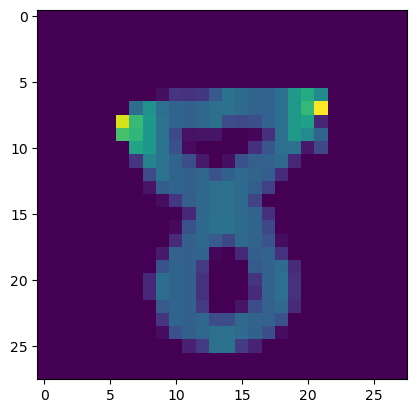
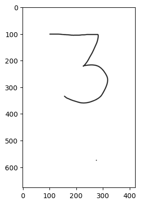

# ML_model_HDR

Handwritten digit recognition using TinyML revolutionizes the field of embedded machine learning by enabling the deployment of lightweight models directly onto resourceconstrained devices like microcontrollers and IoT sensors. By optimizing model architectures and leveraging techniques such as quantization and pruning, TinyML models achieve high accuracy while minimizing computational overhead. This approach facilitates real-time inference and edge computing , empowering devices to perform intelligent tasks autonomously without relying on cloud-based processing or external connectivity. With TinyML, handwritten digit recognition becomes not just a computational task, but a pervasive capability embedded within everyday objects, contributing to the proliferation of smart and interconnected systems in the Internet of Things era. 
 
 
 

 
 
 
 
 

 
 
 
 
 

